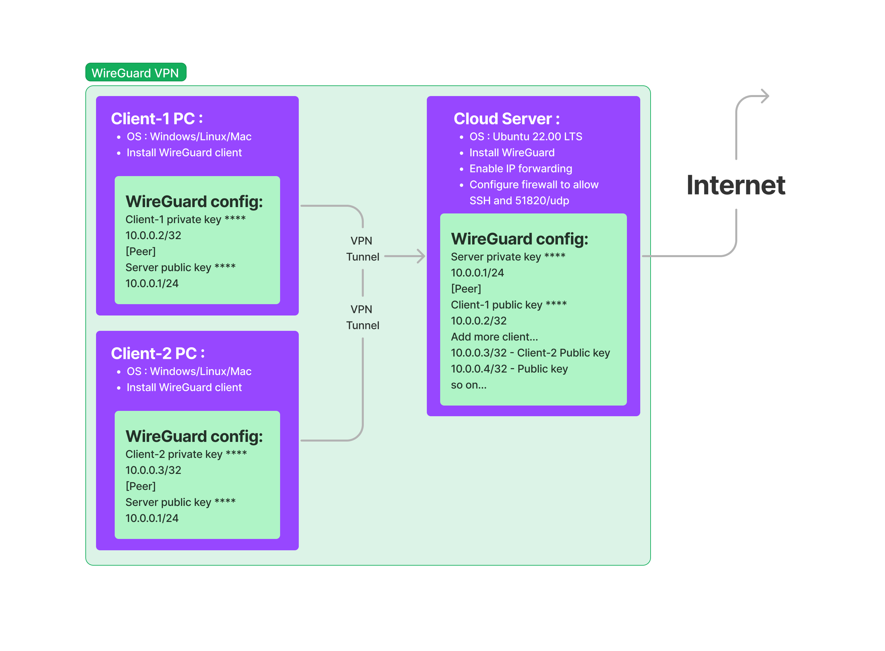

# wireguard
Wireguard VPN server setup shell script

# Getting started
Install and configure wireguard on Ubuntu server with setupserver.sh shell script.  
[Additional wireguard setup info](https://upcloud.com/resources/tutorials/get-started-wireguard-vpn)

## VPN layout diagram

